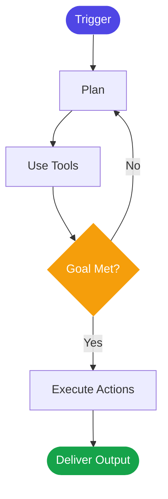

Progress Pilot is not a passive assistant that waits for you to ask questions — it is an autonomous AI agent that plans multi-step workflows, calls external tools, takes actions on your behalf, and iterates until a task is complete. Built on Google's Agent Development Kit (ADK), the agent combines large-scale reasoning with deep integrations into your existing operational stack. Whether you need a post-meeting summary distributed across three channels or a cross-team status report compiled from Jira, Slack, and Google Docs, Progress Pilot handles the full sequence end to end — with no manual hand-holding required.

## What Makes It an Agent

Most AI tools respond to a single prompt with a single response. An agent is fundamentally different: it receives a goal, breaks that goal into steps, decides which tools to invoke at each step, acts on the results of those tools, and keeps iterating until the goal is met or a stopping condition is reached.

<CardGroup cols={2}>
  <Card title="Planning" icon="list-check">
    The agent decomposes your goal into an ordered sequence of sub-tasks before taking any action.
  </Card>
  <Card title="Tool Use" icon="wrench">
    It calls connected integrations — calendars, documents, databases, Slack — to gather context and execute actions.
  </Card>
  <Card title="Execution" icon="bolt">
    Actions are carried out autonomously: creating tickets, sending messages, generating reports, and updating records.
  </Card>
  <Card title="Iteration" icon="arrows-rotate">
    If a tool returns unexpected data or a step fails, the agent replans and retries rather than stopping silently.
  </Card>
</CardGroup>

## Built on Google ADK

Progress Pilot is built on the [Google Agent Development Kit (ADK)](https://google.github.io/adk-docs/), Google's open framework for constructing production-grade AI agents. For you as a customer, this means:

- **Google-scale reasoning:** The agent runs on Gemini models, giving it multimodal understanding across text, documents, and structured data.
- **Reliable tool orchestration:** ADK's built-in tool-calling layer handles retries, timeouts, and error recovery automatically.
- **Multimodal support:** The agent can reason over meeting transcripts, written documents, spreadsheet exports, and structured JSON outputs in a single task.
- **Auditability:** Every tool call, decision point, and output is traceable — a requirement ADK enforces at the framework level.

## Agent Lifecycle

Every task that Progress Pilot executes follows a consistent lifecycle from trigger to delivery. Understanding this flow helps you predict how the agent will behave and where to look when something needs review.

| Stage | What Happens |
|---|---|
| **Trigger** | A scheduled event, webhook, or manual invocation starts the task. |
| **Plan** | The agent reads the task goal and produces a step-by-step execution plan. |
| **Use Tools** | It calls the tools it needs — reading calendars, querying databases, fetching documents. |
| **Goal Met?** | The agent evaluates whether it has enough information and results to produce a final output. |
| **Execute Actions** | It writes outputs: posts Slack messages, creates Jira tickets, generates report PDFs. |
| **Deliver Output** | The final artifact is delivered to the configured destination and stored in your workspace. |

## Task Types

Progress Pilot can perform a wide range of operational tasks across your organization. Each task type maps to a specific set of tools and a reasoning strategy.

<Tabs>
  <Tab title="Meeting Intelligence">
    After a meeting ends, the agent reads the transcript, identifies action items, surfaces decisions made, and distributes summaries to the right people via Slack or email — all without manual input.

    - Post-meeting summary generation
    - Action item extraction and Jira ticket creation
    - Decision log compilation
    - Participant follow-up distribution
  </Tab>
  <Tab title="Cross-Team Coordination">
    The agent monitors project status across teams by reading Jira boards, Slack threads, and Google Docs, then synthesizes a unified status view that surfaces blockers and dependencies.

    - Cross-team status aggregation
    - Blocker and risk identification
    - Stakeholder digest generation
    - Escalation routing
  </Tab>
  <Tab title="Reporting Modernization">
    Legacy reporting workflows that require manual copy-paste across spreadsheets and documents are replaced by agent-driven pipelines that pull live data and produce formatted reports on a schedule.

    - Automated weekly and monthly reports
    - Real-time dashboard data compilation
    - Comparative trend analysis
    - Executive summary generation
  </Tab>
  <Tab title="Strategic Planning Support">
    The agent assists with planning cycles by aggregating team capacity data, historical performance metrics, and project backlogs into structured planning artifacts.

    - OKR progress tracking
    - Capacity and resource summaries
    - Retrospective data compilation
    - Planning deck generation
  </Tab>
</Tabs>

## How the Agent Uses Context

Progress Pilot reasons over multiple sources of context simultaneously to produce accurate, relevant outputs. When executing a task, the agent may draw on:

- **Meeting transcripts** — the full text of a meeting, used to extract action items, decisions, and key themes
- **Previous reports** — past outputs stored in your workspace, used to detect trends and maintain consistent formatting
- **Team and project data** — Jira issues, Slack channel history, and Google Docs pulled via tool calls at runtime
- **Workspace configuration** — your team structure, role assignments, and custom templates registered in Progress Pilot settings

The agent weights recent context more heavily than older data and always cites the source of information it uses in its final output, so you can verify any claim it makes.

## Agent Memory and Session Context

Progress Pilot maintains two types of memory:

**Session context** is active only during a single task run. It holds the intermediate results of tool calls, the current execution plan, and working notes the agent generates as it reasons. Session context is cleared when the task completes.

**Workspace memory** persists across tasks. It stores structured outputs — reports, summaries, action item logs — and makes them available as context for future tasks within the same workspace. Workspace memory is scoped strictly to your organization; no data crosses workspace boundaries.

<Note>
  Progress Pilot never stores raw audio recordings. When a meeting is processed, only the text transcript and structured outputs (summaries, action items, decisions) are retained. Raw audio is discarded immediately after transcription and is never written to any storage layer.
</Note>

## Agent Limits

The following limits apply to all Progress Pilot plans. Enterprise customers can request higher limits by contacting support.

| Limit | Starter | Pro | Enterprise |
|---|---|---|---|
| Max task duration | 5 minutes | 15 minutes | 60 minutes |
| Concurrent tasks | 3 | 10 | Configurable |
| Context window (tokens) | 32,000 | 128,000 | 1,000,000 |
| Workspace memory retention | 30 days | 90 days | Configurable |
| Transcript length (per meeting) | 2 hours | 8 hours | Unlimited |

If a task exceeds its maximum duration, the agent saves its intermediate progress, flags the task as `timed_out`, and sends a notification to the workspace administrator. You can resume or retry the task from the Progress Pilot dashboard.
