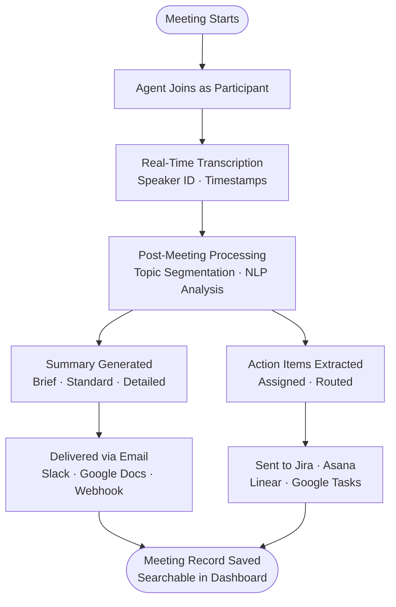

Progress Pilot's meeting intelligence transforms every meeting into a structured, searchable, and actionable record. Rather than relying on a team member to take manual notes, the AI agent joins your meetings as a participant, transcribes the conversation in real time, identifies speakers, segments topics, and delivers polished summaries and action items the moment the call ends. Whether you're running a weekly standup, a cross-functional planning session, or an executive review, Progress Pilot ensures that nothing discussed is ever lost or left untracked.

## What Meeting Intelligence Does

Once enabled, the Progress Pilot agent operates as an always-on observer across all your connected meeting platforms. It handles the full lifecycle of meeting knowledge — from the moment a call begins to long-term tracking of the commitments made during it.

- **Real-time transcription** — The agent captures a verbatim transcript as the meeting progresses, with speaker labels and timestamps attached to every turn of the conversation.
- **Topic segmentation** — Transcript content is automatically grouped by topic or agenda item, so you can navigate a long meeting without reading every line.
- **Structured summaries** — After the meeting ends, Progress Pilot generates a tiered summary (brief, standard, or detailed) and delivers it to your inbox, Slack workspace, or Google Docs folder.
- **Action item extraction** — Direct commitments and follow-up tasks are identified in the transcript, assigned to the relevant team members, and routed to your task management tools.
- **Sentiment and decision tracking** — The agent flags key decisions and provides an overall sentiment signal for each meeting, giving leaders a fast read on team alignment.

## Supported Platforms

Progress Pilot integrates natively with the three most widely used meeting platforms in enterprise environments:

| Platform | Join Method | Transcript Source |
|---|---|---|
| Google Meet | Calendar invite or auto-join | Real-time audio stream |
| Zoom | Calendar invite or bot link | Real-time audio stream |
| Microsoft Teams | Calendar invite or auto-join | Real-time audio stream |

## Enabling Meeting Intelligence

Activating meeting intelligence requires two one-time steps: connecting your calendar so that Progress Pilot can detect upcoming meetings, and authorizing the agent to join calls on your behalf.

<Steps>
  <Step title="Connect your calendar">
    Navigate to **Settings → Integrations → Calendar** and connect your Google Calendar, Outlook, or Exchange account. Progress Pilot will read your upcoming events to identify meetings that need coverage.
  </Step>
  <Step title="Authorize meeting access">
    Under **Settings → Meeting Intelligence**, toggle **Enable Meeting Agent** to on. You can choose between **Auto-join all meetings** and **Join by invite only** (where you manually add `agent@progresspilot.ai` to individual calendar events).
  </Step>
  <Step title="Configure notification preferences">
    Choose how and where you want meeting outputs delivered — email, Slack, Google Docs, or webhook. You can set global defaults here and override them per meeting type later.
  </Step>
  <Step title="Run a test meeting">
    Schedule a short test call and invite the agent. After the call ends, verify that the transcript, summary, and any action items appear in your **Meetings** dashboard within a few minutes.
  </Step>
</Steps>

## Explore Meeting Intelligence

<CardGroup cols={2}>
  <Card title="Note Taking" icon="microphone" href="/meetings/note-taking">
    Learn how the agent joins meetings, captures verbatim transcripts with speaker labels, and organizes content by topic.
  </Card>
  <Card title="Summaries" icon="file-lines" href="/meetings/summaries">
    Configure summary formats, delivery channels, and templates for recurring meeting types.
  </Card>
  <Card title="Action Items" icon="list-check" href="/meetings/action-items">
    See how Progress Pilot extracts commitments from transcripts and routes them to Jira, Asana, Linear, and more.
  </Card>
  <Card title="Integrations" icon="plug" href="/integrations/overview">
    Connect meeting intelligence outputs to your existing tools — task managers, wikis, Slack, and data pipelines.
  </Card>
</CardGroup>

## Meeting Data Flow

The following diagram illustrates how Progress Pilot processes a meeting from start to finish:

## Privacy and Participant Notification

<Warning>
Progress Pilot is designed with transparency at its core. Every participant in a meeting is notified when the Progress Pilot agent is present — either through a visible participant entry in the meeting UI or through a pre-meeting calendar notification. You are responsible for ensuring that your use of meeting intelligence complies with applicable recording consent laws in your jurisdiction. In many regions, all-party consent is required before recording or transcribing a conversation.
</Warning>

The agent never joins a meeting silently. On platforms that support it (Google Meet, Zoom), the agent appears as a named participant — **"Progress Pilot"** — and a notification banner is displayed to attendees when it joins. You can customize the agent's display name in **Settings → Meeting Intelligence → Agent Identity**.

Meeting transcripts and summaries are stored with the same access controls as the rest of your Progress Pilot workspace. Only workspace members with the **Meeting Viewer** role or above can access meeting records. Raw transcripts can be permanently deleted from **Meetings → [Meeting Record] → Delete Transcript** at any time.
